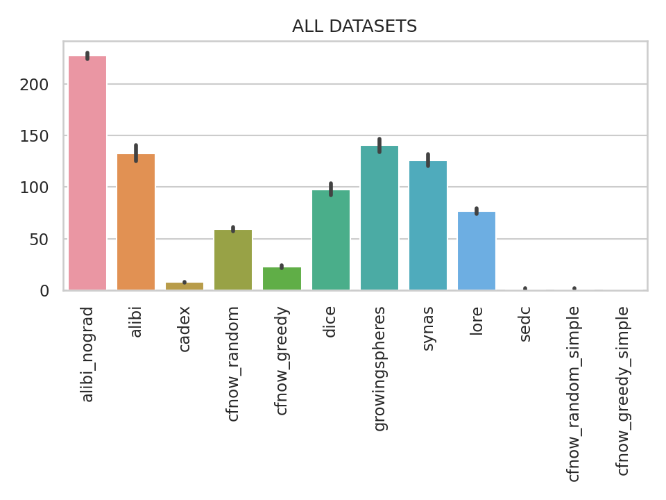

# Ranking for Tabular Counterfactual Explanation Generators

This repository shows the benchmark of counterfactual generation algorithms in terms of (click for details):

<details>
  <summary>Coverage</summary>

    how many factuals are converted to counterfactuals?

</details>

<details>
  <summary>Sparsity</summary>

    how many features are unchanged?

</details>

<details>
  <summary>L2 distance</summary>

    how far are the counterfactuals from the factual data?

</details>

<details>
  <summary>Mean Absolute Deviation</summary>

    how different are the counterfactuals from the factual data considering feature variations?

</details>

<details>
  <summary>Mahalanobis distance</summary>

    how different are the counterfactuals from the factual data considering the data distribution?

</details>

<details>
  <summary>Time</summary>

    how long does it take to generate a counterfactual?

</details>

### How to include your CF generation algorithm
Follow the instructions on the [CounterfactualBenchmark repository](https://github.com/ADMAntwerp/CounterfactualBenchmark)

## RESULTS

All experiments consider a confidence level of 95%.

### Ranking Table
<details>
  <summary>Click here to see why we use ranking instead of the metrics itself</summary>

Most metrics cannot be directly compared as each algorithm has a different coverage. For example, if one algorithm 
only creates a single counterfactual and has a sparsity of 90%, we cannot say it is better than another algorithm 
that creates 1 000 counterfactuals and with sparsity of 88%. Therefore, the ranking consider these cases, giving a
better picture of the algorithms' performance.

</details>

The rankings below were created with Friedman's test to evaluate the null hypothesis that the algorithms are equal.
And Nemenyi's test to evaluate the significance of the difference between the algorithms.
The highlighted results are the ones that are statistically significant.

<div style="font-style: italic;" markdown="1">

### Ranking for all datasets

</div>


<table id="T_90e05">
  <thead>
    <tr>
      <th class="index_name level0" >framework</th>
      <th id="T_90e05_level0_col0" class="col_heading level0 col0" >alibi</th>
      <th id="T_90e05_level0_col1" class="col_heading level0 col1" >cadex</th>
      <th id="T_90e05_level0_col2" class="col_heading level0 col2" >alibi_nograd</th>
      <th id="T_90e05_level0_col3" class="col_heading level0 col3" >N</th>
    </tr>
    <tr>
      <th class="index_name level0" >index</th>
      <th class="blank col0" >&nbsp;</th>
      <th class="blank col1" >&nbsp;</th>
      <th class="blank col2" >&nbsp;</th>
      <th class="blank col3" >&nbsp;</th>
    </tr>
  </thead>
  <tbody>
    <tr>
      <th id="T_90e05_level0_row0" class="row_heading level0 row0" >validity</th>
      <td id="T_90e05_row0_col0" class="data row0 col0" >2.08</td>
      <td id="T_90e05_row0_col1" class="data row0 col1" >🥇1.84</td>
      <td id="T_90e05_row0_col2" class="data row0 col2" >2.08</td>
      <td id="T_90e05_row0_col3" class="data row0 col3" >3925</td>
    </tr>
    <tr>
      <th id="T_90e05_level0_row1" class="row_heading level0 row1" >sparsity</th>
      <td id="T_90e05_row1_col0" class="data row1 col0" >1.92</td>
      <td id="T_90e05_row1_col1" class="data row1 col1" >2.33</td>
      <td id="T_90e05_row1_col2" class="data row1 col2" >🥇1.75</td>
      <td id="T_90e05_row1_col3" class="data row1 col3" >3925</td>
    </tr>
    <tr>
      <th id="T_90e05_level0_row2" class="row_heading level0 row2" >L2</th>
      <td id="T_90e05_row2_col0" class="data row2 col0" >2.11</td>
      <td id="T_90e05_row2_col1" class="data row2 col1" >2.08</td>
      <td id="T_90e05_row2_col2" class="data row2 col2" >🥇1.81</td>
      <td id="T_90e05_row2_col3" class="data row2 col3" >3925</td>
    </tr>
    <tr>
      <th id="T_90e05_level0_row3" class="row_heading level0 row3" >MAD</th>
      <td id="T_90e05_row3_col0" class="data row3 col0" >2.05</td>
      <td id="T_90e05_row3_col1" class="data row3 col1" >2.05</td>
      <td id="T_90e05_row3_col2" class="data row3 col2" >🥇1.90</td>
      <td id="T_90e05_row3_col3" class="data row3 col3" >3925</td>
    </tr>
    <tr>
      <th id="T_90e05_level0_row4" class="row_heading level0 row4" >MD</th>
      <td id="T_90e05_row4_col0" class="data row4 col0" >2.09</td>
      <td id="T_90e05_row4_col1" class="data row4 col1" >2.03</td>
      <td id="T_90e05_row4_col2" class="data row4 col2" >🥇1.88</td>
      <td id="T_90e05_row4_col3" class="data row4 col3" >3925</td>
    </tr>
  </tbody>
</table>


<div style="font-style: italic;" markdown="1">

### Ranking for categorical datasets

</div>


<table id="T_4f4f2">
  <thead>
    <tr>
      <th class="index_name level0" >framework</th>
      <th id="T_4f4f2_level0_col0" class="col_heading level0 col0" >alibi</th>
      <th id="T_4f4f2_level0_col1" class="col_heading level0 col1" >cadex</th>
      <th id="T_4f4f2_level0_col2" class="col_heading level0 col2" >alibi_nograd</th>
      <th id="T_4f4f2_level0_col3" class="col_heading level0 col3" >N</th>
    </tr>
    <tr>
      <th class="index_name level0" >index</th>
      <th class="blank col0" >&nbsp;</th>
      <th class="blank col1" >&nbsp;</th>
      <th class="blank col2" >&nbsp;</th>
      <th class="blank col3" >&nbsp;</th>
    </tr>
  </thead>
  <tbody>
    <tr>
      <th id="T_4f4f2_level0_row0" class="row_heading level0 row0" >validity</th>
      <td id="T_4f4f2_row0_col0" class="data row0 col0" >2.27</td>
      <td id="T_4f4f2_row0_col1" class="data row0 col1" >🥇1.56</td>
      <td id="T_4f4f2_row0_col2" class="data row0 col2" >2.17</td>
      <td id="T_4f4f2_row0_col3" class="data row0 col3" >1327</td>
    </tr>
    <tr>
      <th id="T_4f4f2_level0_row1" class="row_heading level0 row1" >sparsity</th>
      <td id="T_4f4f2_row1_col0" class="data row1 col0" >2.27</td>
      <td id="T_4f4f2_row1_col1" class="data row1 col1" >🥇1.88</td>
      <td id="T_4f4f2_row1_col2" class="data row1 col2" >🥇1.85</td>
      <td id="T_4f4f2_row1_col3" class="data row1 col3" >1327</td>
    </tr>
    <tr>
      <th id="T_4f4f2_level0_row2" class="row_heading level0 row2" >L2</th>
      <td id="T_4f4f2_row2_col0" class="data row2 col0" >2.27</td>
      <td id="T_4f4f2_row2_col1" class="data row2 col1" >🥇1.88</td>
      <td id="T_4f4f2_row2_col2" class="data row2 col2" >🥇1.85</td>
      <td id="T_4f4f2_row2_col3" class="data row2 col3" >1327</td>
    </tr>
    <tr>
      <th id="T_4f4f2_level0_row3" class="row_heading level0 row3" >MAD</th>
      <td id="T_4f4f2_row3_col0" class="data row3 col0" >2.40</td>
      <td id="T_4f4f2_row3_col1" class="data row3 col1" >🥇1.71</td>
      <td id="T_4f4f2_row3_col2" class="data row3 col2" >1.89</td>
      <td id="T_4f4f2_row3_col3" class="data row3 col3" >1327</td>
    </tr>
    <tr>
      <th id="T_4f4f2_level0_row4" class="row_heading level0 row4" >MD</th>
      <td id="T_4f4f2_row4_col0" class="data row4 col0" >2.27</td>
      <td id="T_4f4f2_row4_col1" class="data row4 col1" >🥇1.88</td>
      <td id="T_4f4f2_row4_col2" class="data row4 col2" >🥇1.85</td>
      <td id="T_4f4f2_row4_col3" class="data row4 col3" >1327</td>
    </tr>
  </tbody>
</table>


<div style="font-style: italic;" markdown="1">

### Ranking for numerical datasets

</div>


<table id="T_34e7b">
  <thead>
    <tr>
      <th class="index_name level0" >framework</th>
      <th id="T_34e7b_level0_col0" class="col_heading level0 col0" >alibi</th>
      <th id="T_34e7b_level0_col1" class="col_heading level0 col1" >cadex</th>
      <th id="T_34e7b_level0_col2" class="col_heading level0 col2" >alibi_nograd</th>
      <th id="T_34e7b_level0_col3" class="col_heading level0 col3" >N</th>
    </tr>
    <tr>
      <th class="index_name level0" >index</th>
      <th class="blank col0" >&nbsp;</th>
      <th class="blank col1" >&nbsp;</th>
      <th class="blank col2" >&nbsp;</th>
      <th class="blank col3" >&nbsp;</th>
    </tr>
  </thead>
  <tbody>
    <tr>
      <th id="T_34e7b_level0_row0" class="row_heading level0 row0" >validity</th>
      <td id="T_34e7b_row0_col0" class="data row0 col0" >🥇1.98</td>
      <td id="T_34e7b_row0_col1" class="data row0 col1" >🥇2.05</td>
      <td id="T_34e7b_row0_col2" class="data row0 col2" >🥇1.97</td>
      <td id="T_34e7b_row0_col3" class="data row0 col3" >1598</td>
    </tr>
    <tr>
      <th id="T_34e7b_level0_row1" class="row_heading level0 row1" >sparsity</th>
      <td id="T_34e7b_row1_col0" class="data row1 col0" >🥇1.74</td>
      <td id="T_34e7b_row1_col1" class="data row1 col1" >2.53</td>
      <td id="T_34e7b_row1_col2" class="data row1 col2" >🥇1.73</td>
      <td id="T_34e7b_row1_col3" class="data row1 col3" >1598</td>
    </tr>
    <tr>
      <th id="T_34e7b_level0_row2" class="row_heading level0 row2" >L2</th>
      <td id="T_34e7b_row2_col0" class="data row2 col0" >1.98</td>
      <td id="T_34e7b_row2_col1" class="data row2 col1" >2.04</td>
      <td id="T_34e7b_row2_col2" class="data row2 col2" >1.99</td>
      <td id="T_34e7b_row2_col3" class="data row2 col3" >1598</td>
    </tr>
    <tr>
      <th id="T_34e7b_level0_row3" class="row_heading level0 row3" >MAD</th>
      <td id="T_34e7b_row3_col0" class="data row3 col0" >🥇1.83</td>
      <td id="T_34e7b_row3_col1" class="data row3 col1" >2.35</td>
      <td id="T_34e7b_row3_col2" class="data row3 col2" >🥇1.82</td>
      <td id="T_34e7b_row3_col3" class="data row3 col3" >1598</td>
    </tr>
    <tr>
      <th id="T_34e7b_level0_row4" class="row_heading level0 row4" >MD</th>
      <td id="T_34e7b_row4_col0" class="data row4 col0" >2.01</td>
      <td id="T_34e7b_row4_col1" class="data row4 col1" >1.99</td>
      <td id="T_34e7b_row4_col2" class="data row4 col2" >2.01</td>
      <td id="T_34e7b_row4_col3" class="data row4 col3" >1598</td>
    </tr>
  </tbody>
</table>


<div style="font-style: italic;" markdown="1">

### Ranking for mixed datasets

</div>


<table id="T_c86dc">
  <thead>
    <tr>
      <th class="index_name level0" >framework</th>
      <th id="T_c86dc_level0_col0" class="col_heading level0 col0" >alibi</th>
      <th id="T_c86dc_level0_col1" class="col_heading level0 col1" >cadex</th>
      <th id="T_c86dc_level0_col2" class="col_heading level0 col2" >alibi_nograd</th>
      <th id="T_c86dc_level0_col3" class="col_heading level0 col3" >N</th>
    </tr>
    <tr>
      <th class="index_name level0" >index</th>
      <th class="blank col0" >&nbsp;</th>
      <th class="blank col1" >&nbsp;</th>
      <th class="blank col2" >&nbsp;</th>
      <th class="blank col3" >&nbsp;</th>
    </tr>
  </thead>
  <tbody>
    <tr>
      <th id="T_c86dc_level0_row0" class="row_heading level0 row0" >validity</th>
      <td id="T_c86dc_row0_col0" class="data row0 col0" >🥇1.99</td>
      <td id="T_c86dc_row0_col1" class="data row0 col1" >🥇1.89</td>
      <td id="T_c86dc_row0_col2" class="data row0 col2" >2.12</td>
      <td id="T_c86dc_row0_col3" class="data row0 col3" >1000</td>
    </tr>
    <tr>
      <th id="T_c86dc_level0_row1" class="row_heading level0 row1" >sparsity</th>
      <td id="T_c86dc_row1_col0" class="data row1 col0" >1.74</td>
      <td id="T_c86dc_row1_col1" class="data row1 col1" >2.62</td>
      <td id="T_c86dc_row1_col2" class="data row1 col2" >🥇1.63</td>
      <td id="T_c86dc_row1_col3" class="data row1 col3" >1000</td>
    </tr>
    <tr>
      <th id="T_c86dc_level0_row2" class="row_heading level0 row2" >L2</th>
      <td id="T_c86dc_row2_col0" class="data row2 col0" >2.10</td>
      <td id="T_c86dc_row2_col1" class="data row2 col1" >2.42</td>
      <td id="T_c86dc_row2_col2" class="data row2 col2" >🥇1.47</td>
      <td id="T_c86dc_row2_col3" class="data row2 col3" >1000</td>
    </tr>
    <tr>
      <th id="T_c86dc_level0_row3" class="row_heading level0 row3" >MAD</th>
      <td id="T_c86dc_row3_col0" class="data row3 col0" >1.95</td>
      <td id="T_c86dc_row3_col1" class="data row3 col1" >2.01</td>
      <td id="T_c86dc_row3_col2" class="data row3 col2" >2.04</td>
      <td id="T_c86dc_row3_col3" class="data row3 col3" >1000</td>
    </tr>
    <tr>
      <th id="T_c86dc_level0_row4" class="row_heading level0 row4" >MD</th>
      <td id="T_c86dc_row4_col0" class="data row4 col0" >1.99</td>
      <td id="T_c86dc_row4_col1" class="data row4 col1" >2.31</td>
      <td id="T_c86dc_row4_col2" class="data row4 col2" >🥇1.70</td>
      <td id="T_c86dc_row4_col3" class="data row4 col3" >1000</td>
    </tr>
  </tbody>
</table>


### Coverage analysis

The results below consider **valid** counterfactuals. In other words, counterfactuals that: (1) have a different prediction class if compared to the factual and (2) respects binary and one-hot encoding rules.

<div style="font-style: italic; text-align: center;" markdown="1">

### Coverage (%) for all datasets

</div>

<p align="center">

</p>

<div style="font-style: italic; text-align: center;" markdown="1">

### Coverage (%) for categorical datasets

</div>

<p align="center">

</p>

<div style="font-style: italic; text-align: center;" markdown="1">

### Coverage (%) for numerical continuous datasets

</div>

<p align="center">

</p>

<div style="font-style: italic; text-align: center;" markdown="1">

### Coverage (%) for mixed datasets

</div>

<p align="center">

</p>

### Time Analysis
Time spent (in seconds) to generate a counterfactual explanation

<div style="font-style: italic; text-align: center;" markdown="1">

### Generation time (seconds) for all datasets

</div>

<p align="center">

</p>

<div style="font-style: italic; text-align: center;" markdown="1">

### Generation time (seconds) for categorical datasets

</div>

<p align="center">

</p>

<div style="font-style: italic; text-align: center;" markdown="1">

### Generation time (seconds) for numerical continuous datasets

</div>

<p align="center">

</p>

<div style="font-style: italic; text-align: center;" markdown="1">

### Generation time (seconds) for mixed datasets

</div>

<p align="center">

</p>


## Reference
If you used this package on your experiments, here's the reference paper:
```bibtex
@Article{app11167274,
AUTHOR = {de Oliveira, Raphael Mazzine Barbosa and Martens, David},
TITLE = {A Framework and Benchmarking Study for Counterfactual Generating Methods on Tabular Data},
JOURNAL = {Applied Sciences},
VOLUME = {11},
YEAR = {2021},
NUMBER = {16},
ARTICLE-NUMBER = {7274},
URL = {https://www.mdpi.com/2076-3417/11/16/7274},
ISSN = {2076-3417},
DOI = {10.3390/app11167274}
}
```
